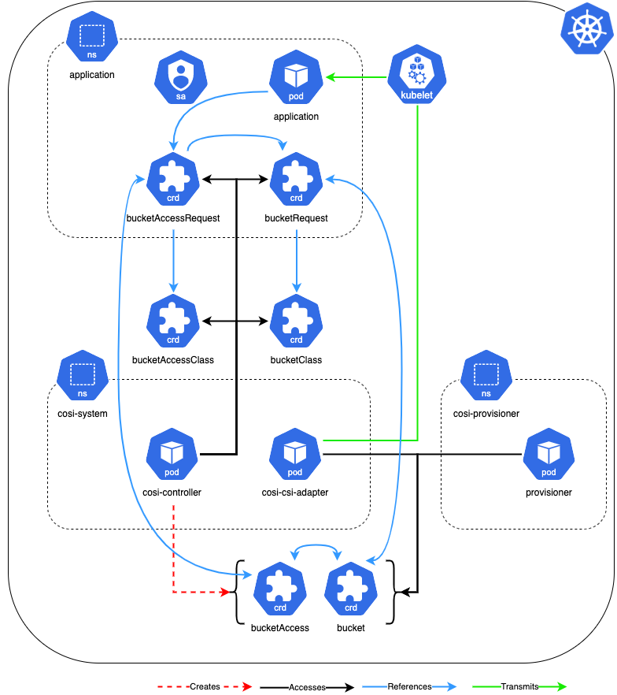

# Object Bucket Provisioning

## Table of Contents

<!-- toc -->
- [Summary](#summary)
  - [Motivation](#motivation)
  - [Goals](#goals)
  - [Non-Goals](#non-goals)
  - [Vocabulary](#vocabulary)
- [Proposal](#proposal)
  - [User Stories](#user-stories)
      - [Admin](#admin)
      - [User](#user)
  - [APIs](#apis)
    - [Storage APIs](#storage-apis)
      - [BucketRequest](#bucketrequest)
      - [Bucket](#bucket)
      - [BucketClass](#bucketclass)
    - [Access APIs](#access-apis)
      - [BucketAccessRequest](#bucketaccessrequest)
      - [BucketAccess](#bucketaccess)
      - [BucketAccessClass](#bucketaccessclass)
  - [Provisioner Secrets](#provisioner-secrets)
<!-- /toc -->
# Summary

This proposal introduces the *Container Object Storage Interface* (COSI), a system composed of Custom Resource Definitions (CRDs), a controller architecture, and a gRPC specification, for the purpose of standardizing object storage representations in Kubernetes.  Goals and non-goals set the scope for the proposal by defining higher level objectives.  The vocabulary section defines terminology.  User stories illustrate how these APIs may fulfill cluster user requirements.  Relationships between the APIs are provided to illustrate the interconnections between object storage APIs, users' workloads, and object store service instances.  Lastly, the documents states the proposed API specs for the Bucket, Bucket, and BucketClass objects.

## Motivation

File and block are first class citizens within the Kubernetes ecosystem.  Object, though very different under the hood, is a popular means of storing data, especially against very large data sources.   As such, we feel it is in the interest of the community to integrate object storage into Kubernetes, supported by the SIG-Storage community.  In doing so, we can provide Kubernetes cluster users and administrators a normalized and familiar means of managing object storage. 

While absolute portability cannot be guaranteed because of incompatibilities between providers, workloads reliant on a given protocol (e.g. one of S3, GCS, Azure Blob) may be defined in a single manifest and deployed wherever that protocol is supported.

This proposal does _not_ include a standardized *protocol* or abstraction of storage vendor APIs

## Goals

+ Specify object storage Kubernetes APIs for the purpose of orchestrating object store operations
+ Implement a Kubernetes controller architecture with support for pluggable provisioners
+ As MVP, be accessible to the largest groups of consumers by supporting the major object storage protocols (S3, Google Cloud Storage, Azure Blob) while being extensible for future protocol additions.
+ Present similar workflows for both greenfield and brownfield bucket operations.

## Non-Goals

+ Define the _data-plane_ object store interface to replace or supplement existing vendor interfaces (i.e. replace GCS, S3, or Azure Blob)

##  Vocabulary

+  _Brownfield Bucket_ - a storage instance created out of band.
+ _BucketRequest_ - A user-namespaced custom resource representing a request for a storage instance endpoint.
+  _BucketClass_ - A cluster-scoped custom resource containing fields defining the provisioner and an immutable parameter set for creating new buckets
+ _Bucket_ - A cluster-scoped custom resource referenced by a Bucket and containing connection information and metadata for a storage instance.
+ _Greenfield Bucket_ - a bucket created by automation.
+  _Object_ - An atomic, immutable unit of data stored in buckets.
+  *Storage Instance* - Refers to the back object storage endpoint being abstracted by the Bucket API (a.k.a “bucket” or “container”).
+ _Driverless_ - A system where not driver is deployed to automate object store operations.  COSI automation may still be deployed to managed COSI APIs.  See [Architecture](#architecture).

# Proposal

## User Stories

#### Admin

- As a cluster administrator, I can manage multiple object store providers via the Kubernetes API, so that I can see all object storage instances from a single pane, regardless of the backing storage vendor.

#### User

- As a developer, I can define my object storage needs in the same manifest as my workload, so that deployments are streamlined and encapsulated within the Kubernetes interface.
- As a developer, I can define a manifest containing my workload and object storage configuration once, so that my app may be ported between clusters as long as the storage provided supports my designated data path protocol.
- As a developer, I want to create a workload controller which is bucket API aware, so that it can dynamically connect workloads to object storage instances.

## APIs

> NOTE: For a graphical mapping of how these APIs relate to each other, see [API Relationships](#api-relationships).


### Storage APIs

#### BucketRequest

A namespaced API representing a workload’s need for a storage instance endpoint. Created in the workload's namespace.  A [BucketAccessRequest](#bucketaccessrequest) is required in order to gain credentialed access to the storage instance.


```yaml
apiVersion: cosi.io/v1alpha1
kind: BucketRequest
metadata:
  name:
  namespace:
  labels:
    cosi.io/provisioner: [1]
  finalizers:
  - cosi.io/finalizer [2]
spec:
  protocol: [3]
  bucketPrefix: [4]
  bucketClassName: [5]
  secretName: [6]
  bucketName: [7]
status:
  phase: [9]
  conditions: 
```

1. `labels`: should be added by controller.  Key’s value should be the provisioner name. Characters that do not adhere to [Kubernetes label conventions](https://kubernetes.io/docs/concepts/overview/working-with-objects/labels/#syntax-and-character-set) will be converted to ‘-’.
1. `finalizers`: should be added by controller to defer BucketRequest deletion until backend deletion ops succeed.
1. `protocol`: specifies the desired protocol.  One of {“s3”, “gcs”, or “azureBlob”}.
1. `bucketPrefix`: (Optional) prefix prepended to a randomly generated bucket name, eg. “yosemite-photos-". If empty no prefix is prepended.
1. `bucketClassName`: Name of the target BucketClass.
1. `secretName`: (optional) Secret in the BucketRequest's namespace storing credentials to be used by a workload for bucket access.
1. `bucketName`: Name of the Bucket instance representing the desired storage instance endpoint.  Set by the COSI Controller for new Buckets.  Specified by the user when connecting to existing buckets.
1. `phase`: 
   - *Pending*: The controller has detected the new `Bucket` and begun provisioning operations
   - *Bound*: Provisioning operations have completed and the `Bucket` has been bound to a `Bucket`.

#### Bucket

A cluster-scoped resource representing a storage instance.  A Bucket should contain enough information to enable the requesting client to access the storage instance.  At a minimum, a Bucket must store enough identifying information such in order for drivers to accurately target the storage instance (e.g. during a deletion process).

```yaml
apiVersion: cosi.io/v1alpha1
kind: Bucket
Metadata:
  name: [1]
  labels:
    cosi.io/provisioner: [2]
  finalizers:
  - cosi.io/finalizer [3]
spec:
  provisioner: [4]
  releasePolicy: [5]
  anonymousAccessMode: [6]
    - private
    - publicRead
    - publicReadWrite
  bucketClassName: [7]
  permittedNamespaces: [8]
    - name:
      uid:
  protocol: [9]
    protocolSignature: ""
    azureBlob: [10]
      containerName:
      storageAccount:
    s3: [11]
      endpoint:
      bucketName:
      region:
      signatureVersion:
    gcs: [12]
      bucketName:
      privateKeyName:
      projectId:
      serviceAccount:
  parameters: [13]
status:
  message: [14]
  phase: [15]
  conditions:
```

1. `name`: For Greenfield, generated in the pattern of `bucket-<my-bucket>-<my-bucket-namespace>`. 
1. `labels`: should be added by controller..  Key’s value should be the provisioner name. Characters that do not adhere to [Kubernetes label conventions](https://kubernetes.io/docs/concepts/overview/working-with-objects/labels/#syntax-and-character-set) will be converted to ‘-’.
1. `finalizers`: should be added by controller to defer `Bucket` deletion until backend deletion ops succeed.
1. `provisioner`: The provisioner field defined in the `BucketClass`.  Used by sidecars to filter Buckets.
1. `releasePolicy`: Prescribes outcome of a Delete events. **Note:** In Brownfield cases, backing storage instance is Retained, and never deleted.
   - _Delete_:  the bucket and its contents are destroyed.
   - _Retain_:  the bucket and its data are preserved with only abstracting Kubernetes being destroyed.
1. `anonymousAccessMode`:  ACL specifying *uncredentialed* access to the Bucket.  This is applicable for cases where the storage instance or objects are intended to be publicly readable and/or writable.  If `BucketClass.anonymousAccessMode` is set, the value is copied here.  Accepted values:
   - `private`: Default, disallow uncredentialed access to the storage instance.
   - `ro`: Read only, uncredentialed users are permitted *read* operations for objects within the storage instance.
   - `rw`: Read/Write, uncredentialed users are permitted *read and write* operations for objects within the storage instance. 
   - `wo`: Write, uncredentialed users are permitted *write* operations for objects within the storage instance. 
1. `bucketClassName`: Name of the associated BucketClass.
1. `permittedNamespaces`: An array of namespaces, identified by a name and uid, from which  BucketRequests are allowed to bind to the Bucket.  Provided to allow admins a layer of cluster-layer access control.  Does **not** reflect or alter the backing storage instances' ACLs or IAM policies.
   - In Greenfield, the originating BuckerRequest’s namespace must be specified at time of Bucket generation.
   - In Brownfield, this list is defined by the admin.
1. `protocol`: The protocol the application will use to access the storage instance.
   - `protocolSignature`: Specifies the protocol targeted by this Bucket instance.  One of:
     - `azureBlob`: data required to target a provisioned azure container and/or storage account.
     - `s3`: data required to target a provisioned S3 bucket and/or user.
     - `gcs`: data required to target a provisioned GCS bucket and/or service account.
1. `parameters`: a copy of the BucketClass parameters.
1. `message`: a human readable description detailing the reason for the current `phase``.
1. `phase`: is the current state of the Bucket:
   - _Ready_: the controller finished processing and the controller is ready to receive access requests.
   - _Released_: the originating Bucket has been deleted, signalling that the Bucket is ready for garbage collection.  This will occur on Greenfield Buckets once all requests referencing the Bucket are deleted.
   - _Failed_: error and all retries have been exhausted.
   - _Retrying_: set when a driver or Kubernetes error is encountered during provisioning operations indicating a retry loop.

#### BucketClass

A cluster-scoped API whose purpose it to provide admins control over the handling of bucket provisioning by specifying provisioner-defined key-values in the `parameters` map.  The `BucketClass` defines a release policy, and specifies driver specific parameters and the provisioner name.

```yaml
apiVersion: cosi.io/v1alpha1
kind: BucketClass
metadata:
  name: 
provisioner: [1]
isDefaultBucketClass: [2]
supportedProtocols: {"azureblob", "gcs", "s3", ... } [3]
anonymousAccessMode: {"ro", "wo", "rw"} [4]
additionalPermittedNamespaces: [5]
- name:
  uid: 
releasePolicy: {"Delete", "Retain"} [6]
parameters: [7]
```

1. `provisioner`: The name of the driver. If supplied the driver container and sidecar container are expected to be deployed. If omitted the `secretRef` is required for static provisioning.
1. `isDefaultBucketClass`: boolean. When true, signals that the controller should attempt to match `Bucket`’s without a defined `BucketClass` to this class, accounting for the `Bucket`’s requested protocol.  Multiple default classes for the same protocol will produce undefined behaviour.
1. `supportedProtocols`: protocols the associated object store supports.  Applied when matching Bucket to BucketClasses. Admins may specify all protocols a provisioner supports.  `Bucket.spec.protocol` will be checked against the array prior to provisioning.
1. `anonymousAccessMode`: (Optional) ACL specifying *uncredentialed* access to the Bucket.  This is applicable for cases where the storage instance or objects are intended to be publicly readable and/or writable.
1. `additionalPermittedNamespaces`: A list of namespace *in addition to the originating namespace* that will be allowed access to this Bucket.  A nil and empty string value are equivalent and must not append any namespace to `Bucket.spec.permittedNamespaces` list.
1. `releasePolicy`: Prescribes outcome of a Delete events. **Note:** In Brownfield and Static cases, *Retain* is mandated. 
   - `Delete`:  the bucket and its contents are destroyed
   - `Retain`:  the bucket and its data are preserved with only abstracting Kubernetes being destroyed
1. `parameters`:  (Optional)  A map of string, string key values.  Allows admins to control user and access provisioning by setting provisioner key-values.

### Access APIs

The Access APIs abstract the backend policy system.  Access policy and user identities are an integral part of most object stores.  As such, a system must be implemented to manage both user/credential creation and the binding of those users to individual buckets via policies.  Object stores differ from file and block storage in how they manage users, with cloud providers typically integrating with an IAM platform.  This API includes support for cloud platform identity integration with Kubernetes ServiceAccounts.  On-prem solutions usually provide their own user management systems, which may look very different from each other and from IAM platforms.  We must also account for third party authentication solutions that may be integrated with an on-prem service.

#### BucketAccessRequest

A user facing API representing an object store user and an access policy defining the user’s relation to a storage instance.  A user will create a BucketAccessRequest in the app namespace.  A BucketAccessRequest can specify *either* a ServiceAccount in the same namespace or a desired Secret name.  Specifying a ServiceAccount enables provisioners to support cloud provider identity integration with their respective Kubernetes cluster offerings.

```yaml
apiVersion: cosi.io/v1alpha1
kind: BucketAccessRequest
metadata:
  name:
  namespace:
  labels:
    cosi.io/provisioner: [1]
  finalizers:
  - cosi.io/finalizer [2]
spec:
  serviceAccountName: [3]
  bucketRequest: [4] 
  bucketAccessClassName: [5]
  bucketAccessName: [6]
status:
  message: [7]
  phase: [8]
```

1. `labels`: should be added by controller.  Key’s value should be the provisioner name. Characters that do not adhere to [Kubernetes label conventions](https://kubernetes.io/docs/concepts/overview/working-with-objects/labels/#syntax-and-character-set) will be converted to ‘-’.
1. `finalizers`: should be added by controller to defer `BucketAccessRequest` deletion until backend deletion ops succeed.
1. `serviceAccountName`: the name of a Kubernetes ServiceAccount in the same namespace.  This field is included to support cloud provider identity integration.  Should not be set when specifying `accessSecretName`.
1. `bucket`: The the name of the bucket to which the user identity or ServiceAccount should be granted access to, according to the policies defined in the `BucketAccessClass`.
1. `bucketAccessClassName`: name of the `BucketAccessClass` specifying the desired set of policy actions to be set for a user identity or ServiceAccount.
1. `bucketAccessName`: name of the bound cluster-scoped `BucketAccess` instance
1. `message`: a human readable description detailing the reason for the current `phase``.
1. `phase`: is the current state of the Bucket:
   - _Bound_: the controller finished processing and has bound the BucketAccess to the BucketRequest via the BucketRequest.Spec.BucketAccessRequestName and BucketRequest.Spec.BucketAccessRequestNamespace
   - _Failed_: error and all retries have been exhausted.
   - _Retrying_: set when a driver or Kubernetes error is encountered during provisioning operations indicating a retry loop.

#### BucketAccess

A cluster-scoped administrative API which encapsulates fields from the BucketAccessRequest and the BucketAccessClass.  The purpose of the API is to server as communication path between provisioner and a central COSI controller.  In Greenfield, the COSI controller will create BucketAccess instances for new BucketAccessRequests.  The relationship between a BucketAccessRequests and a BucketAccess should be 1:1.  

```yaml
apiVersion: cosi.io/v1alpha1
kind: BucketAccess
metadata: 
  name: [1]
  labels:
    cosi.io/provisioner: [2]
  finalizers:
  - cosi.io/finalizer [3]
 spec:
  bucketAccessRequestName: [4]
  bucketAccessRequestNamespace: [4]
  serviceAccountName: [5]
  accessSecretName: [6]
  provisioner: [7]
  parameters: [8]
 status:
  message: [9]
  phase: [10]
```

1. `name`: For Greenfield, generated in the pattern of `bucketAccessRequest-<my-bucketAccessRequest>-<my-bucketAccessRequest-namespace>`. 
1. `labels`: should be added by controller.  Key’s value should be the provisioner name. Characters that do not adhere to [Kubernetes label conventions](https://kubernetes.io/docs/concepts/overview/working-with-objects/labels/#syntax-and-character-set) will be converted to ‘-’.
1. `finalizers`: should be added by controller to defer `BucketAccess` deletion until backend deletion ops succeed.
1. `bucketAccessRequestName`/`bucketAccessRequestNamespace`: name and namespace of the bound `BucketAccessRequest`
1. `serviceAccountName`: name of the Kubernetes ServiceAccount specified by the `BucketAccessRequest`.  Undefined when the `BucketAccessRequest.accessSecretName` is defined.
1. `  accessSecretName`: name of the *provisioner* generated `Secret` containing access credentials. This `Secret` exists in the provisioner’s namespace and must be copied to the app namespace by the COSI controller.
1. `provisioner`:  name of the provisioner that should handle this `BucketAccess` instance.  Copied from the `BucketAccessClass`.
1. `parameters`:  A map of string, string key values.  Allows admins to control user and access provisioning by setting provisioner key-values.
1. `message`: a human readable description detailing the reason for the current `phase``.
1. `phase`: is the current state of the Bucket:
   - _Bound_: the controller finished processing the request and has bound the BucketAccess to the BucketAccessRequest
   - _Released_: the originating Bucket has been deleted, signalling that the Bucket is ready for garbage collection.  This will occur on Greenfield Buckets once all requests referencing the Bucket are deleted.
   - _Failed_: error and all retries have been exhausted.
   - _Retrying_: set when a driver or Kubernetes error is encountered during provisioning operations indicating a retry loop.

#### BucketAccessClass

A cluster-scoped API providing a way for admins to specify policies that may be used to access buckets.  These are always applicable in Greenfield, where access is dynamically granted, and only sometimes applicable in Brownfield, where a user identity may already exist, but not yet have access to a bucket.  In this case, a BucketAccessRequest will still specify the BucketAccessClass in order to determine which actions it is granted to a defined bucket.

```yaml
apiVersion: cosi.io/v1alpha1
kind: BucketAccessClass
metadata: 
  name:
provisioner: [1]
supportedProtocols: [2]
policyActions: [3]
  allow:
  - "*"
  deny:
  - "*"
parameters: [4]
```

1. `provisioner`: The name of the provisioner that `BucketAccess` instances should be managed by.
1. `supportedProtocols`: protocols the associated object store supports.  Applied when matching Bucket to BucketClasses.  Admins may specify more than protocol when necessary.  `BucketAccessRequests.spec.protocol` will be checked against this array prior to provisioning.
1. `policyActions`: a set of provisioner/platform defined policy actions to allow or deny a given user identity.
1. `parameters`:   (Optional)  A map of string, string key values.  Allows admins to control user and access provisioning by setting provisioner key-values.


---

## COSI Architecture (Warning - Construction Area)

### Topology




### Greenfield

In an automated system where bucket lifecycles are managed by a controller:

1. A BucketClass is defined to enable the provisioning of object store storage, with a specified configuration.
2. A user will define a [Bucket](#bucket) with the [BucketClass](#bucketclass) specified.  
3. A [Bucket](#Bucket) is instantiated and encapsulates all configuration information from the BucketClass and Bucket.  The Bucket will store all necessary information about the provisioned storage instance, including connection data.  Credentials and other sensitive information should not be stored in a Bucket. 
4. A driver will then provision the object storage and return the connection information, to be written to the Bucket.


#### Sharing Dynamically Created Buckets

Once a [Bucket](#Bucket) is created, it is discoverable by other users in the cluster.  

5. In order to access the Bucket, a user may create a [Bucket](#bucket) that specifies the Bucket by name.

> Note: Per [Non-Goals](#non-goals), access management is not within the scope of this KEP.  ACLs, access policies, and credentialing should be handled out of band.

### Brownfield

“Brownfield” describes any case where the bucket already exists in the cloud service and is *not yet represented* by a [Bucket](#Bucket) instance.  In order to publish the cloud service bucket to the cluster:

1. The bucket should already be provisioned in the cloud service.
1. A Bucket is created to represent the provisioned bucket.  
1. Once done, Bucket API instances may be created by users, specifying the desired Bucket.

>  Note: Per [Non-Goals](#non-goals), access management is not within the scope of this KEP.  ACLs, access policies, and credentialing should be handled out of band.  Buckets may be configured to whitelist access for specific namespaces.

---

## Provisioner Secrets

Per [Non-Goals](#non-goals), it is not within the scope of the proposal to abstract IAM operations.  Instead, provisioner and user credentials should be provided to automation by admins or users.  

To allow for flexibility in authorizing provisioner operations, credentials may be provided to the provisioner in several ways.

- **Per Provisioner:** the Secret is used for all provisioning operations, for the lifetime of the provisioner.  These Secrets should be injected directly into the provisioner's container via [common Kubernetes patterns](https://kubernetes.io/docs/tasks/inject-data-application/distribute-credentials-secure/).

Credentials may also be specified at more granular levels in order to allow for context dependent keys.  E.g. When authorization differs between BucketClasses or between individual operations.  This may be facilitated by defining a set of string keys which the core automation will be aware of, so that Secrets may be referenced by BucketClasses.  For example:

```yaml
cosi.io/provisioner-secret-name:
cosi.io/provisioner-secret-namespace:
```

- **Per BucketClass:** A secret may be made specific to a BucketClass.  This suits cases where authorization may be segregated in the object store.  The Secret may then be defined explicitly in the `bucketClass.parameters` map.

  ```yaml
  cosi.io/provisioner-secret-name: "foo"
  cosi.io/provisioner-secret-namespace: "bar"
  ```

- **Per Operation/Bucket:** Unique credentials are passed per Bucket or operation. In order to support dynamic Secret naming, templating similar to [CSI Secret templating](https://kubernetes-csi.github.io/docs/secrets-and-credentials-storage-class.html) may be used.  E.g.

  ```yaml
  "${bucket.name}"
  "${bucket.namespace}"
  ```
  
  Admins may then define a BucketClass with the following parameters included:

  *Per Bucket Operation*
  
  ```yaml
  cosi.io/provisioner-secret-name: "${bucket.name}"
  cosi.io/provisioner-secret-namespace: "${bucket.namespace}"
  ```
