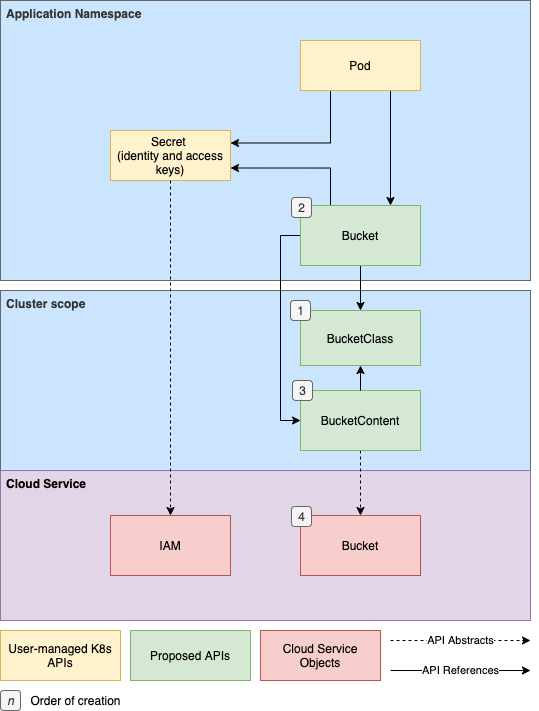
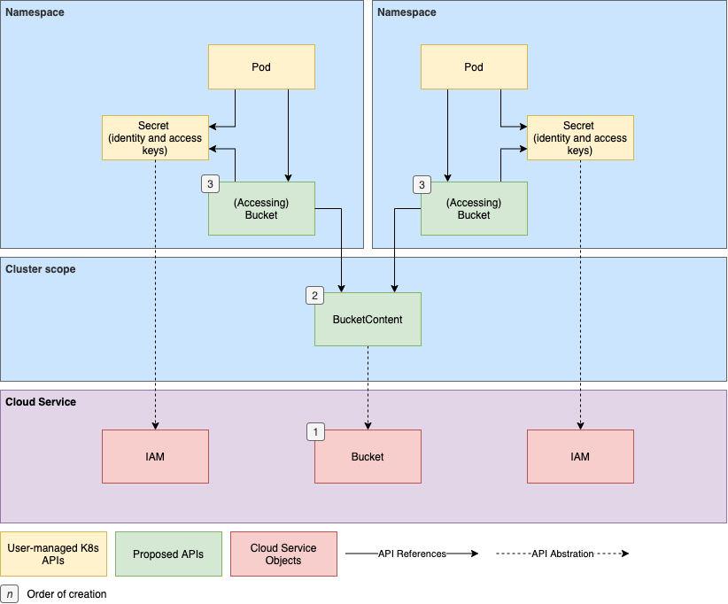

# Object Bucket Provisioning

## Table of Contents

<!-- toc -->
- [Summary](#summary)
  - [Motivation](#motivation)
  - [Goals](#goals)
  - [Non-Goals](#non-goals)
  - [Vocabulary](#vocabulary)
- [Proposal](#proposal)
  - [User Stories](#user-stories)
      - [Admin](#admin)
      - [User](#user)
  - [API Relationships](#api-relationships)
    - [Greenfield: Dynamic Bucket Creation](#greenfield-dynamic-bucket-creation)
    - [Brownfield: Dynamic Bucket Access](#brownfield-dynamic-bucket-access)
    - [Brownfield: Driverless Bucket Access](#brownfield-driverless-bucket-access)
    - [Manually Managed Buckets](#manually-managed-buckets)
    - [Provisioner Secrets](#provisioner-secrets)
  - [Custom Resource Definitions](#custom-resource-definitions)
      - [Bucket](#bucket)
      - [BucketContent](#bucketcontent)
      - [BucketClass](#bucketclass)
<!-- /toc -->

# Summary

This proposal introduces Custom Resource Definitions (CRDs), for the purpose of standardizing object storage representations in Kubernetes.  Goals and non-goals set the scope for the proposal by defining higher level objectives.  The vocabulary section defines terminology.  User stories illustrate how these APIs may fulfill cluster user requirements.  Relationships between the APIs are provied to illustrate the interconnnections between object storage APIs, users' workloads, and object store service instances.  Lastly, the documents states the proposed API specs for the Bucket, BucketContent, and BucketClass objects.

## Motivation

File and block are first class citizens within the Kubernetes ecosystem.  Object, though very different under the hood, is a popular means of storing data, especially against very large data sources.   As such, we feel it is in the interest of the community to elevate buckets to a community supported feature.  In doing so, we can provide Kubernetes cluster users and administrators a normalized and familiar means of managing object storage.

While absolute portability cannot be guaranteed because of incompatibilities between providers, workloads reliant on a given protocol (e.g. one of S3, GCS, Azure Blob) may be defined in a single manifest and deployed wherever that protocol is supported.

The object storage API will also provide a path towards community maintained automatio, which will be capable of bucket lifecycle operations.  It is anticipated that the controller provide an API such that pluggable drivers may be written to implement operations specific to the object store provider.

This proposal does _not_ include a standardized *protocol* or abstraction of storage vendor APIs

## Goals

+ Define a control plane API in order to standardize and formalize Kubernetes object storage representation
+ As MVP, be accessible to the largest groups of consumers by supporting the major object storage protocols (S3, Google Cloud Storage, Azure Blob) while being extensible for future protocol additions.
+ Present similar workflows for both greenfield and brownfield bucket operations.

## Non-Goals

+ Define the _data-plane_ object store interface.
+ Precisely define automation around proposed bucket APIs
+ Manage user identities or roles

##  Vocabulary

+  _Brownfield Bucket_ - externally created and represented by a [BucketClass](#bucketclass) and managed by a provisioner.
+ _Bucket_ - A user-namespaced custom resource representing an object store bucket.
+  _BucketClass_ - A cluster-scoped custom resource containing fields defining the provisioner and an immutable parameter set.
   + _In Greenfield_: an abstraction of new bucket provisioning.
   + _In Brownfield_: an abstration of an single existing object store bucket.
+ _BucketContent_ - A cluster-scoped custom resource bound to a [Bucket](#bucket) and containing relevant metadata.
+ _Greenfield Bucket_ - a created bucket whose lifecycle is managed a controller
+  _Object_ - An atomic, immutable unit of data stored in buckets.
+ _Driverless_ - a bucket manually defined by a user or admin with no installed provisioner.

# Proposal

## User Stories

#### Admin

- As a cluster administrator, I can manage multiple object store providers via the Kubernetes API, so that I can see all object storage instances from a single pane, regardless of the backing storage vendor.

#### User

- As a developer, I can define my object storage needs in the same manifest as my workload, so that deployments are streamlined and encapsulated within the Kubernetes interface.
- As a developer, I can define a manifest containing my workload and object storage configuration once, so that my app may be ported between clusters as long as the storage provided supports my designated data path protocol.
- As a developer, I want to create a workload controller which is bucket API aware, so that it can dynamically connect workloads to object storage instances.

## API Relationships

The diagram below indicates the relationships, by reference, between the proposed APIs, the user facing Kubernetes primitives, and the actual storage and identity instances.  Bucket APIs bridge the gap between workloads and object stores, providing a standardized means of consuming object storage for Kubernetes controllers and workloads.

Secrets are used to store the cluster user’s object store authn/authz information, to be passed to automation so that operations can be performed on the user’s behalf.

- **Green** objects represent Bucket APIs.
- **Yellow** objects represent user defined Kubernetes primitives
- **Red** objects represent platform service instances (i.e. storage and users)
- **Grey** objects represent *possible* connectors between the Bucket API and workloads.

### Greenfield: Dynamic Bucket Creation

In an automated system where bucket lifecycles are managed by a controller, a user will define a [Bucket](#bucket), containing a reference a [Bucket Class](#bucketclass).  Bucket Classes are admin-created objects representing a preset configuration for bucket creation.  A [Bucket Content](#bucketcontent) object is generated and encapsulates all configuration information from the BucketClass and Bucket.  The BucketContent will store all necessary information about the provisioned storage instance, including connection data.




### Brownfield: Dynamic Bucket Access

The expected workflow for interacting with a pre-existing storage instance is similar to [Greenfield](#). The key distinction in this scenario is that a Bucket Class will reference a single, pre-existing bucket directly (indicated by the bold dashed line).  The key values for specifying storage instances should be made in the BucketClass’s parameters.  

BucketContent objects will be created for Buckets, with the connection information for the storage instance populated from the BucketClass’s .  As part of this operation, the identity specified in the Bucket’s Secret should be granted permission to access the storage instance.  This operation should be configurable through the BucketClass parameters.





### Brownfield: Driverless Bucket Access

Clusters with a bucket controller deployed but without a provisioner to manage backend bucket operations may still support pseudo-dynamic bucket access.  Similar to the [Brownfield: Dynamic Bucket Access](#greenfield-dynamic-bucket-creation), the BucketClass will specify a single pre-existing bucket.

The key difference in this case is that without a driver to communicate with an object store, operations such as adding an identity to an ACL or managing bucket polices are not possible.  As such, applications must have credentials that are permissioned to access the backing bucket.  The API will serve purely as a representation of the bucket.

### Manually Managed Buckets

Clusters with zero automation around the API still benefit from it when deploying Bucket aware workload-orchistrating controllers.   This case is releveant as it’s likely to be the first step towards adoption for some users.  The app will In this case, admins would define BucketContents themselves and users would create Buckets with a prefilled `bucketContentRef` specifying the BucketContent.  After that, a workload controller would be ready to inject connection and credential data from the BucketContent into the worker pods.


### Provisioner Secrets

Per [Non-Goals](#non-goals), it is not within the scope of the proposal to abstract IAM operations.  Instead, provisioner and user credentials should be provided to automation by admins or users.  

BucketClass.Parameter key values are used to specify Secret name and namespace.  These may be considered of different degrees of granularity.

- **Per Provisioner:** the Secret is used for all provisioning operations.  These Secrets should be injected directly in provisioner containers via [common Kubernetes patterns](https://kubernetes.io/docs/tasks/inject-data-application/distribute-credentials-secure/).
- **Per Operation/Bucket:** Secret’s data is passed to provisioners per operation or Bucket.  These Secrets should be defined as BucketClass parameters.  The keys should be clearly defined during automation design.

This model should support both plain string values as well as “templates.”  Plain string values will allow admins to specify a particular Secret by name and namespace.  The key values should provide a means of defining *provisioner* credentials as well as *user* credentials.  User credentials may be required in cases where a user is being granted access to an existing bucket or when a user has permissions to create buckets themselves.

As an example, the following key’s represent a minimun of what automation should support.  `provisioner-secret*` keys specify Secret to be used for bucket operations.  `user-secret-*` keys specify Secrets containing user identity information.

```yaml
cosi.io/provisioner-secret-name:
cosi.io/provisioner-secret-namespace:
cosi.io/user-secret-name:
cosi.io/user-secret-namespace:
```

Bucket automation should support templating of Secret names and namespaces. For example:

```yaml
cosi.io/user-secret-name: "${bucket.name}"
cosi.io/user-secret-namespace: "${bucket.namespace}-region-west"
```

> Note: Annotation key templates are not mentioned as of yet.  However, need for them may arise during automation design.

## Custom Resource Definitions

#### Bucket

A user facing API object representing an object store bucket. Created by a user in their app's namespace. Once provisiong is complete, the `Bucket` is "bound" to the corresponding `BucketContent`. Binding is 1:1, meaning there is only one `BucketContent` per `Bucket` and vice-versa.


```yaml
apiVersion: cosi.io/v1alpha1
kind: Bucket
metadata:
  name:
  namespace:
  labels:
    cosi.io/provisioner: [1]
  finalizers:
  - cosi.io/finalizer [2]
spec:
  protocol: [3]
  bucketPrefix: [4]
  bucketClassName: [5]
  accessSecretName: [6]
status:
  bucketContentName: [7]
  phase: [8]
  conditions: 
```
1. `labels`: should be added by controller.  Key’s value should be the provisioner name. Characters that do not adhere to [Kubernetes label conventions](https://kubernetes.io/docs/concepts/overview/working-with-objects/labels/#syntax-and-character-set) will be converted to ‘-’.
1. `finalizers`: should be added by controller to defer `Bucket` deletion until backend deletion ops succeed.
1. `protocol`: specifies the desired protocol.  One of {“s3”, “gcs”, or “azureBlob”}.
1. `bucketPrefix`: (Optional) prefix prepended to a randomly generated bucket name, eg. "YosemitePhotos-". If empty no prefix is appended.
1. `bucketClassName`: Name of the target `BucketClass`.
1. `userSecretName`: (optional) Secret in the Bucket’s namespace storing credentials to be used by a workload for bucket access.
1. `bucketContentName`: Name of a bound `BucketContent`.
1. `phase`: 
   - *Pending*: The controller has detected the new `Bucket` and begun provisioning operations
   - *Bound*: Provisioning operations have completed and the `Bucket` has been bound to a `BucketContent`.

#### BucketContent

A cluster-scoped resource representing an object store bucket. The `BucketContent` is expected to store stateful data relevant to bucket deprovisioning. The `BucketContent` is bound to the `Bucket` in a 1:1 mapping. For MVP a `BucketContent` is not reused.

```yaml
apiVersion: cosi.io/v1alpha1
kind: BucketContent
Metadata:
  name: [1]
  labels:
    cosi.io/provisioner: [2]
  finalizers:
  - cosi.io/finalizer [3]
spec:
  provisioner: [4]
  releasePolicy: [5]
  accessMode: [6]
  bucketClassName: [7]
  bucketRef: [8]
    name:
    namespace:
    uuid:
  secretRef: [9]
    name:
    namespace:
  protocol: [10]
    type: ""
    azureBlob: [11]
      containerName:
    s3: [12]
      endpoint:
      bucketName:
      region:
      signatureVersion:
      publicAccess:
    gcs: [13]
      bucketName:
      privateKeyName:
      projectId:
      serviceAccount:
  parameters: [14]
status:
  message: [15]
  phase: [16]
  conditions:
```
1. `name`: Generated in the pattern of `<BUCKET-CLASS-NAME>'-'<RANDOM-SUFFIX>`. 
1. `labels`: should be added by controller..  Key’s value should be the provisioner name. Characters that do not adhere to [Kubernetes label conventions](https://kubernetes.io/docs/concepts/overview/working-with-objects/labels/#syntax-and-character-set) will be converted to ‘-’.
1. `finalizers`: should be added by controller to defer `Bucket` deletion until backend deletion ops succeed.
1. `provisioner`: The provisioner field defined in the `BucketClass`.  Used by sidecars to filter BucketContents.
1. `releasePolicy`: Prescribes outcome of a Delete events. **Note:** In Brownfield and Static cases, *Retain* is mandated.
    - _Delete_:  the bucket and its contents are destroyed
    - _Retain_:  the bucket and its data are preserved with only abstracting Kubernetes being destroyed
1. `accessMode`: Declares the level of access given to credentials provisioned through this class.     If empty, drivers may set defaults.
1. `bucketClassName`: Name of the associated `BucketClass`.
1. `bucketRef`: the name & namespace of the associated `Bucket`.
   
    - `name` : the `Bucket`’s name
    - `namespace`: the `Bucket’`s namespace
    - `uuid`: the `Bucket`’s API server generated UUID
1. `secretRef`: the name and namespace of the source secret.  This `secret` is either generated by the driver or created by an admin.
1. `protocolAzureBlob`: data required to target a provisioned azure container and/or storage account
1. `protocol`: the protocol specified by the `Bucket`.
1. `protocolS3`: data required to target a provisioned S3 bucket and/or user
1. `protocolGcs`: data required to target a provisioned GCS bucket and/or service account
1. `parameters`: a copy of the BucketClass parameters
1. `message`: a human readable description detailing the reason for the current `phase``
1. `phase`: is the current state of the `BucketContent`:
     - _Bound_: the controller finished processing the request and bound the `Bucket` and `BucketContent`
     - _Released_: the `Bucket` has been deleted, signalling that the `BucketContent` is ready for garbage collection.
     - _Failed_: error and all retries have been exhausted.
     - _Retrying_: set when a driver or Kubernetes error is encountered during provisioning operations indicating a retry loop.

#### BucketClass

A cluster-scoped custom resource used to describe both greenfield and brownfield buckets.  The `BucketClass` defines a release policy, and specifies driver specific parameters and the provisioner name. The `provisioner` value is used by sidecars to filter `BucketContent` objects.

There is currently no default bucket class.

```yaml
apiVersion: cosi.io/v1alpha1
kind: BucketClass
metadata:
  name: 
provisioner: [1]
isDefaultBucketClass: [2]
supportedProtocols: {"azureblob", "gcs", "s3", ... } [3]
accessMode: {"ro", "wo", "rw"} [4]
releasePolicy: {"Delete", "Retain"} [6]
parameters: [7]
```

1. `provisioner`: The name of the driver. If supplied the driver container and sidecar container are expected to be deployed. If omitted the `secretRef` is required for static provisioning.
1. `isDefaultBucketClass`: boolean. When true, signals that the controller should attempt to match `Bucket`’s without a defined `BucketClass` to this class, accounting for the `Bucket`’s requested protocol.  Multiple default classes for the same protocol will produce undefined behaviour.
1. `supportedProtocols`: protocols the associated object store supports.  Applied when matching Bucket to BucketClasses.
1. `accessMode`: (Optional) ACL setting specifying the default accessibility of .
1. `isPublic`: ACL setting specifying if the a generated storage instance should be publicly accessible.  Common setting among protocols.
1. `releasePolicy`: Prescribes outcome of a Delete events. **Note:** In Brownfield and Static cases, *Retain* is mandated. 
    - `Delete`:  the bucket and its contents are destroyed
    - `Retain`:  the bucket and its data are preserved with only abstracting Kubernetes being destroyed
1. `parameters`: (Optional)  A map of string, string key values.  Contains values passed to the bucket API’s controller and/or drivers
