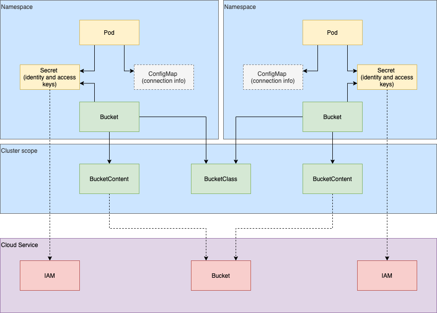
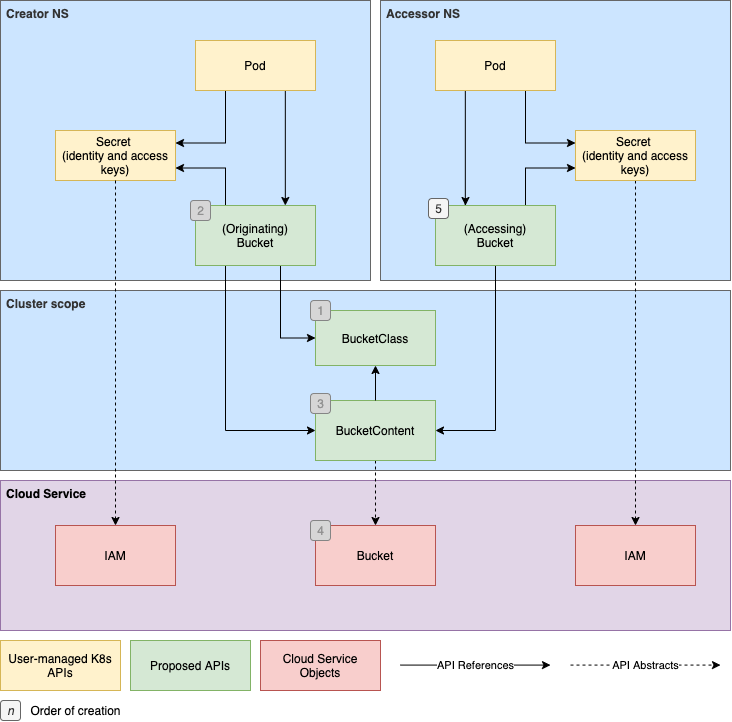

# Object Bucket Provisioning

## Table of Contents

<!-- toc -->
- [Summary](#summary)
  - [Motivation](#motivation)
  - [Goals](#goals)
  - [Non-Goals](#non-goals)
  - [Vocabulary](#vocabulary)
- [Proposal](#proposal)
  - [User Stories](#user-stories)
      - [Admin](#admin)
      - [User](#user)
  - [API Relationships](#api-relationships)
    - [Greenfield](#greenfield)
      - [Sharing Dynamically Created Buckets](#sharing-dynamically-created-buckets)
    - [Brownfield](#brownfield)
    - [Provisioner Secrets](#provisioner-secrets)
  - [Custom Resource Definitions](#custom-resource-definitions)
      - [Bucket](#bucket)
      - [BucketContent](#bucketcontent)
      - [BucketClass](#bucketclass)
<!-- /toc -->

# Summary

This proposal introduces Custom Resource Definitions (CRDs), for the purpose of standardizing object storage representations in Kubernetes.  Goals and non-goals set the scope for the proposal by defining higher level objectives.  The vocabulary section defines terminology.  User stories illustrate how these APIs may fulfill cluster user requirements.  Relationships between the APIs are provided to illustrate the interconnections between object storage APIs, users' workloads, and object store service instances.  Lastly, the documents states the proposed API specs for the Bucket, BucketContent, and BucketClass objects.

## Motivation

File and block are first class citizens within the Kubernetes ecosystem.  Object, though very different under the hood, is a popular means of storing data, especially against very large data sources.   As such, we feel it is in the interest of the community to elevate buckets to a community supported feature.  In doing so, we can provide Kubernetes cluster users and administrators a normalized and familiar means of managing object storage.

While absolute portability cannot be guaranteed because of incompatibilities between providers, workloads reliant on a given protocol (e.g. one of S3, GCS, Azure Blob) may be defined in a single manifest and deployed wherever that protocol is supported.

The object storage API will also provide a path towards community maintained automatio, which will be capable of bucket lifecycle operations.  It is anticipated that the controller provide an API such that pluggable drivers may be written to implement operations specific to the object store provider.

This proposal does _not_ include a standardized *protocol* or abstraction of storage vendor APIs

## Goals

+ Define a control plane API in order to standardize and formalize Kubernetes object storage representation
+ As MVP, be accessible to the largest groups of consumers by supporting the major object storage protocols (S3, Google Cloud Storage, Azure Blob) while being extensible for future protocol additions.
+ Present similar workflows for both greenfield and brownfield bucket operations.

## Non-Goals

+ Define the _data-plane_ object store interface.
+ Precisely define automation around proposed bucket APIs
+ Manage user identities or roles
+ Create a bucket policy interface

##  Vocabulary

+  _Brownfield Bucket_ - a bucket created out of band, to be represented in the cluster.
+ _Bucket_ - A user-namespaced custom resource representing an object store bucket.
+  _BucketClass_ - A cluster-scoped custom resource containing fields defining the provisioner and an immutable parameter set for creating new buckets
+ _BucketContent_ - A cluster-scoped custom resource bound to a [Bucket](#bucket) and containing relevant metadata.
+ _Greenfield Bucket_ - a bucket created by dynamically by automation
+  _Object_ - An atomic, immutable unit of data stored in buckets.
+ _Driverless_ - a bucket manually defined by a user or admin with no installed provisioner.

# Proposal

## User Stories

#### Admin

- As a cluster administrator, I can manage multiple object store providers via the Kubernetes API, so that I can see all object storage instances from a single pane, regardless of the backing storage vendor.

#### User

- As a developer, I can define my object storage needs in the same manifest as my workload, so that deployments are streamlined and encapsulated within the Kubernetes interface.
- As a developer, I can define a manifest containing my workload and object storage configuration once, so that my app may be ported between clusters as long as the storage provided supports my designated data path protocol.
- As a developer, I want to create a workload controller which is bucket API aware, so that it can dynamically connect workloads to object storage instances.

## API Relationships

The diagrams below illustrate the connections between the proposed APIs, the user facing Kubernetes primitives, and the actual storage and identity instances.

Secrets are used to store the cluster user’s cloud service authn/authz information.

> Note: This proposal assumes an integration of Bucket APIs into Pods, similar to that of Volumes such that Pods may consume Buckets directly.  This is subject to change in the design and implementation of the Kubernetes controller(s) for these APIs.

### Greenfield

In an automated system where bucket lifecycles are managed by a controller:

1. A BucketClass is defined to enable the provisioning of object store storage, with a specified configuration.

2. A user will define a [Bucket](#bucket) with the [BucketClass](#bucketclass) specified.  

3. A [BucketContent](#bucketcontent) is instantiated and encapsulates all configuration information from the BucketClass and Bucket.  The BucketContent will store all necessary information about the provisioned storage instance, including connection data.  Credentials and other sensitive information should not be stored in a BucketContent.  

4. A driver will then provision the object storage and return the connection information, to be written to the BucketContent.

   




#### Sharing Dynamically Created Buckets

Once a [BucketContent](#bucketcontent) is created, it is discoverable by other users in the cluster.  

5. In order to access the BucketContent, a user may create a [Bucket](#bucket) that specifies the BucketContent by name.

> Note: Per [Non-Goals](#non-goals), access management is not within the scope of this KEP.  ACLs, access policies, and credentialing should be handled out of band.





### Brownfield

“Brownfield” describes any case where the bucket already exists in the cloud service and is *not yet represented* by a [BucketContent](#bucketcontent) instance.  In order to publish the cloud service bucket to the cluster:

1. The bucket should already be provisioned in the cloud service.
1. A BucketContent is created to represent the provisioned bucket.  
1. Once done, Bucket API instances may be created by users, specifying the desired BucketContent.

>  Note: Per [Non-Goals](#non-goals), access management is not within the scope of this KEP.  ACLs, access policies, and credentialing should be handled out of band.  BucketContents may be configured to whitelist access for specific namespaces.


### Provisioner Secrets

Per [Non-Goals](#non-goals), it is not within the scope of the proposal to abstract IAM operations.  Instead, provisioner and user credentials should be provided to automation by admins or users.  

To allow for flexibility in authorizing provisioner operations, credentials may be provided to the provisioner in several ways.

- **Per Provisioner:** the Secret is used for all provisioning operations, for the lifetime of the provisioner.  These Secrets should be injected directly into the provisioner's container via [common Kubernetes patterns](https://kubernetes.io/docs/tasks/inject-data-application/distribute-credentials-secure/).

Credentials may also be specified at more granular levels in order to allow for context dependent keys.  E.g. When authorization differs between BucketClasses or between individual operations.  This may be facilitated by defining a set of string keys which the core automation will be aware of, so that Secrets may be referenced by BucketClasses.  For example:

```yaml
cosi.io/provisioner-secret-name:
cosi.io/provisioner-secret-namespace:
```

- **Per BucketClass:** A secret may be made specific to a BucketClass.  This suits cases where authorization may be segregated in the object store.  The Secret may then be defined explicitly in the `bucketClass.parameters` map.

  ```yaml
  cosi.io/provisioner-secret-name: "foo"
  cosi.io/provisioner-secret-namespace: "bar"	
  ```

- **Per Operation/Bucket:** Unique credentials are passed per Bucket or operation. In order to support dynamic Secret naming, templating similar to [CSI Secret templating](https://kubernetes-csi.github.io/docs/secrets-and-credentials-storage-class.html) may be used.  E.g.

  ```yaml
  "${bucket.name}"
  "${bucket.namespace}"
  ```
  
  Admins may then define a BucketClass with the following parameters included:

  *Per Bucket Operation*
  
  ```yaml
  cosi.io/provisioner-secret-name: "${bucket.name}"
  cosi.io/provisioner-secret-namespace: "${bucket.namespace}"	
  ```


## Custom Resource Definitions

#### Bucket

A user facing API object representing an object store bucket. Created by a user in their app's namespace. Once provisiong is complete, the `Bucket` is "bound" to the corresponding `BucketContent`. Binding is 1:1, meaning there is only one `BucketContent` per `Bucket` and vice-versa.


```yaml
apiVersion: cosi.io/v1alpha1
kind: Bucket
metadata:
  name:
  namespace:
  labels:
    cosi.io/provisioner: [1]
  finalizers:
  - cosi.io/finalizer [2]
spec:
  protocol: [3]
  bucketPrefix: [4]
  bucketClassName: [5]
  secretName: [6]
status:
  bucketContentName: [7]
  phase: [8]
  conditions: 
```
1. `labels`: should be added by controller.  Key’s value should be the provisioner name. Characters that do not adhere to [Kubernetes label conventions](https://kubernetes.io/docs/concepts/overview/working-with-objects/labels/#syntax-and-character-set) will be converted to ‘-’.
1. `finalizers`: should be added by controller to defer `Bucket` deletion until backend deletion ops succeed.
1. `protocol`: specifies the desired protocol.  One of {“s3”, “gcs”, or “azureBlob”}.
1. `bucketPrefix`: (Optional) prefix prepended to a randomly generated bucket name, eg. "YosemitePhotos-". If empty no prefix is prepended.
1. `bucketClassName`: Name of the target `BucketClass`.
1. `secretName`: (optional) Secret in the Bucket’s namespace storing credentials to be used by a workload for bucket access.
1. `bucketContentName`: Name of a bound `BucketContent`.
1. `phase`: 
   - *Pending*: The controller has detected the new `Bucket` and begun provisioning operations
   - *Bound*: Provisioning operations have completed and the `Bucket` has been bound to a `BucketContent`.

#### BucketContent

A cluster-scoped resource representing an object store bucket. The `BucketContent` is expected to store stateful data relevant to bucket deprovisioning. The `BucketContent` is bound to the `Bucket` in a 1:1 mapping. For MVP a `BucketContent` is not reused.

```yaml
apiVersion: cosi.io/v1alpha1
kind: BucketContent
Metadata:
  name: [1]
  labels:
    cosi.io/provisioner: [2]
  finalizers:
  - cosi.io/finalizer [3]
spec:
  provisioner: [4]
  releasePolicy: [5]
  accessMode: [6]
  bucketClassName: [7]
  bindableNamespaces: [8]
    - name:
      uid:
  protocol: [9]
    type: ""
    azureBlob: [10]
      containerName:
    s3: [11]
      endpoint:
      bucketName:
      region:
      signatureVersion:
    gcs: [12]
      bucketName:
      privateKeyName:
      projectId:
      serviceAccount:
  parameters: [13]
status:
  message: [14]
  phase: [15]
  conditions:
```
1. `name`: For Greenfield, generated in the pattern of `bucket-<my-bucket>-<my-bucket-namespace>`. 
1. `labels`: should be added by controller..  Key’s value should be the provisioner name. Characters that do not adhere to [Kubernetes label conventions](https://kubernetes.io/docs/concepts/overview/working-with-objects/labels/#syntax-and-character-set) will be converted to ‘-’.
1. `finalizers`: should be added by controller to defer `Bucket` deletion until backend deletion ops succeed.
1. `provisioner`: The provisioner field defined in the `BucketClass`.  Used by sidecars to filter BucketContents.
1. `releasePolicy`: Prescribes outcome of a Delete events. **Note:** In Brownfield and Static cases, *Retain* is mandated.
    - _Delete_:  the bucket and its contents are destroyed
    - _Retain_:  the bucket and its data are preserved with only abstracting Kubernetes being destroyed
1. `accessMode`: Declares the level of access given to credentials provisioned through this class.     If empty, drivers may set defaults.
1. `bucketClassName`: Name of the associated `BucketClass`.
1. `bindableNamespaces`: An array of namespaces, identified by a name and uid, that are permitted to bind Buckets to this BucketContent.  Provided to allow admins a layer of control in who can access the backing bucket.  Does **not** reflect or alter the backing bucket’s ACLs or access policies.
1. `protocol`: the protocol specified by the `Bucket`.
1. protocolAzureBlob`: data required to target a provisioned azure container and/or storage account
1. `protocolS3`: data required to target a provisioned S3 bucket and/or user
1. `protocolGcs`: data required to target a provisioned GCS bucket and/or service account
1. `parameters`: a copy of the BucketClass parameters
1. `message`: a human readable description detailing the reason for the current `phase``
1. `phase`: is the current state of the `BucketContent`:
     - _Bound_: the controller finished processing the request and bound the `Bucket` and `BucketContent`
     - _Released_: the `Bucket` has been deleted, signalling that the `BucketContent` is ready for garbage collection.
     - _Failed_: error and all retries have been exhausted.
     - _Retrying_: set when a driver or Kubernetes error is encountered during provisioning operations indicating a retry loop.

#### BucketClass

A cluster-scoped custom resource used to describe both greenfield and brownfield buckets.  The `BucketClass` defines a release policy, and specifies driver specific parameters and the provisioner name. The `provisioner` value is used by sidecars to filter `BucketContent` objects.

```yaml
apiVersion: cosi.io/v1alpha1
kind: BucketClass
metadata:
  name: 
provisioner: [1]
isDefaultBucketClass: [2]
supportedProtocols: {"azureblob", "gcs", "s3", ... } [3]
accessMode: {"ro", "wo", "rw"} [4]
releasePolicy: {"Delete", "Retain"} [6]
parameters: [7]
```

1. `provisioner`: The name of the driver. If supplied the driver container and sidecar container are expected to be deployed. If omitted the `secretRef` is required for static provisioning.
1. `isDefaultBucketClass`: boolean. When true, signals that the controller should attempt to match `Bucket`’s without a defined `BucketClass` to this class, accounting for the `Bucket`’s requested protocol.  Multiple default classes for the same protocol will produce undefined behaviour.
1. `supportedProtocols`: protocols the associated object store supports.  Applied when matching Bucket to BucketClasses.
1. `accessMode`: (Optional) ACL setting specifying the default accessibility of .
1. `releasePolicy`: Prescribes outcome of a Delete events. **Note:** In Brownfield and Static cases, *Retain* is mandated. 
    - `Delete`:  the bucket and its contents are destroyed
    - `Retain`:  the bucket and its data are preserved with only abstracting Kubernetes being destroyed
1. `parameters`: (Optional)  A map of string, string key values.  Contains values passed to the bucket API’s controller and/or drivers
